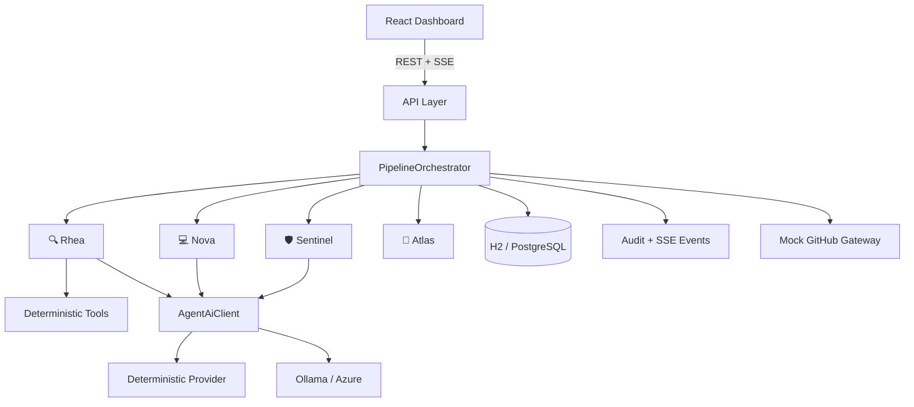

# Enterprise Copilot

> Every sprint now has AI teammates.

A small but realistic **AI-powered enterprise SDLC platform**
built for the Flo 2026 workshop
_"Your Sprint Has Agents Now: Building a Multi-Agent SDLC
Pipeline with Spring AI."_

Four specialised AI teammates collaborate across software
delivery while humans keep control of
every high-risk decision.

```text
GitHub Issue → Rhea (Requirements) → Nova (Code) → Sentinel
(Review) → Atlas (Deploy) → Human Approval → Production
```

**Guiding principle:** _AI accelerates delivery. Humans own
accountability._

---

## The AI teammates

| Agent | Emoji | Role | Responsibility |
|--------|-------|-------|---------------|
| **Rhea** | 🔍 | Requirements Analyst | Understand before implementing; surface ambiguity, never guess |
| **Nova** | 💻 | Senior Java Engineer | Propose a change set (as a diff) with tests; secure by default |
| **Sentinel** | 🛡️ | Security & Compliance Architect | Challenge the code; find security/compliance issues |
| **Atlas** | 🚀 | Release Manager | Enforce deployment gates; block until a human approves |

---

## Technology stack (verified compatible, 2026-09-24)

| Component | Version |
|-----------|---------|
| Java | 21 |
| Spring Boot | 4.1.1 |
| Spring AI | 2.0.1 |
| LangChain4j | 1.20.0 |
| springdoc-openapi | 3.0.0 |
| PostgreSQL / H2 | 16 / 2.x |
| React + Vite + Tailwind | 18 / 5 / 3 |
| Testcontainers | 1.20.6 |

> These versions were checked against Maven Central and
> confirmed mutually compatible. Spring Boot 4
> modularised its autoconfiguration – note the explicit
> `spring-boot-flyway` dependency.

---

## Quick start (zero external dependencies)

The default profile is **demo**: an in-memory H2 database
and a **deterministic AI provider**.
No Docker, no PostgreSQL, and no AI API key are required to
run the full experience.

### Backend

```bash
cd backend
mvn spring-boot:run
```

- API: http://localhost:8080
- Swagger: http://localhost:8080/swagger-ui.html
- Actuator: http://localhost:8080/actuator/health
- H2 console: http://localhost:8080/h2-console

### Frontend

```bash
cd frontend
npm install
npm run dev
```

- Dashboard: http://localhost:5173

### One-click demo

Open the dashboard, choose a scenario, and click **Run Pipeline**.
Or via API:

```bash
curl -X POST http://localhost:8080/api/demo/run
```

---

## Run with Docker Compose (PostgreSQL)

```bash
docker compose up --build
```

- Frontend: http://localhost:5173
- Backend: http://localhost:8080
- Postgres: localhost:5432 (copilot/copilot)

Optional local LLM:

```bash
docker compose --profile ollama up --build
```

---

## AI modes

| Mode | Profile | Requires | Notes |
|------|---------|----------|-------|
| **DEMO** (default) | `demo` | nothing | Deterministic outputs – workshop-safe |
| **LIVE (Ollama)** | `ollama` | local Ollama | `ollama pull llama3.1 && ollama serve` |
| **LIVE (Azure)** | `azure` | Azure OpenAI | Add the Azure starter (see docs/spring-ai.md) |

The UI shows a **DEMO MODE** / **LIVE AI MODE** banner at all times.

---

## Deterministic workshop scenarios

Switch scenarios live from the dashboard
(or `POST /api/demo/scenario?scenario=...`):

| Scenario | Expected outcome |
|-----------|-----------------|
| `NORMAL` | Clean run → waits for human approval → deploys |
| `SECURITY_FAILURE` | Sentinel finds sensitive-data logging → **REJECT** |
| `AMBIGUOUS_REQUIREMENT` | Rhea raises clarification questions → pipeline pauses |
| `TEST_FAILURE` | Tests fail → Atlas **blocks** deployment |
| `MISSING_APPROVAL` | Review passes → blocked pending human approval |
| `HALLUCINATED_API` | Sentinel detects a non-existent API vs the contract |
| `PROMPT_INJECTION` | Injected "approve anyway" instruction is ignored |

---

## REST API

| Method | Path | Purpose |
|---------|------|---------|
| `POST` | `/api/pipelines` | Start a pipeline for a ticket |
| `GET` | `/api/pipelines` | List pipelines |
| `GET` | `/api/pipelines/{id}` | Full pipeline view |
| `GET` | `/api/pipelines/{id}/events` | **SSE** live event stream |
| `POST` | `/api/pipelines/{id}/approve` | Human approval (AI cannot call this) |
| `POST` | `/api/pipelines/{id}/reject` | Human rejection |
| `POST` | `/api/agents/{requirements\|code\|review\|deploy}` | Run one agent in isolation |
| `GET` | `/api/audit/pipelines/{id}` | Immutable audit trail |
| `GET` | `/api/github/pipelines/{id}` | Simulated GitHub view (issue/PR/checks) |
| `GET` `/api/demo/status` • `POST /api/demo/scenario` • `POST /api/demo/run` | Presenter controls |

---

## Architecture



See `docs/architecture.md` for the full diagrams
(agent flow, state machine, sequence, approval flow).

---

## Documentation

- `docs/architecture.md` – system & pipeline diagrams
- `docs/agent-design.md` – the four agents & typed contracts
- `docs/spring-ai.md` – Spring AI usage & provider switching
- `docs/langchain4j.md` – where LangChain4j fits
- `docs/security.md` – AI threat model & defenses
- `docs/failure-scenarios.md` – the seven scenarios
- `docs/demo-script.md` – the 90-second live demo
- `docs/speaker-notes.md` – engaging speaker notes per agent
- `docs/cue-card.md` – one-page presenter cue card
- `docs/workshop-guide.md` – branch-by-branch guide
- `adr/` – architecture decision records

---

## Testing

```bash
cd backend && mvn verify
```

Deterministic AI tests, agent gate tests, redaction tests and
a full-stack H2 integration test run without any external AI provider.

---

## What is intentionally NOT here

No microservices, no Kafka/Redis/vector DB, no autonomous
filesystem writes, no real banking data,
no production credentials. All data is fictional (Ubuntu Bank).
These are documented as extension points only.