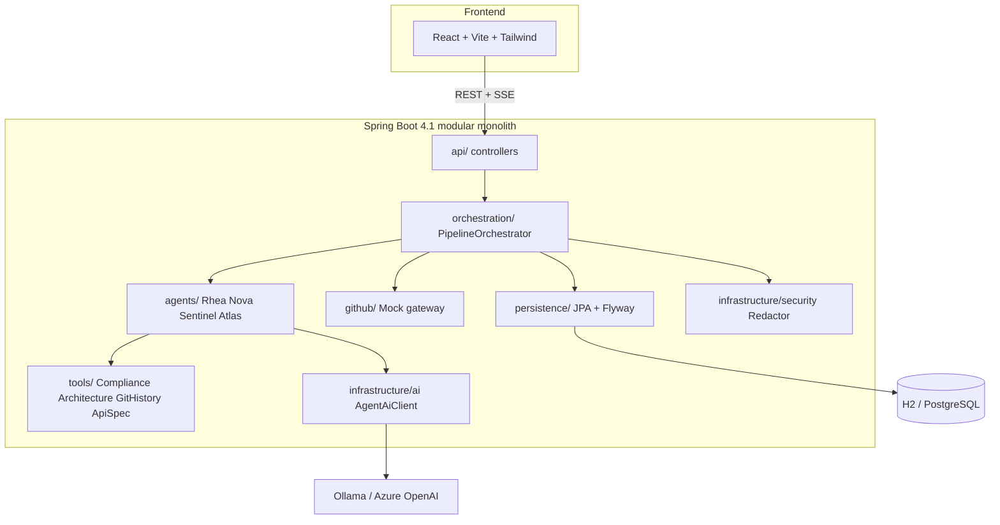
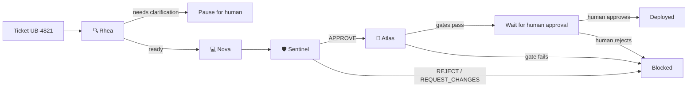
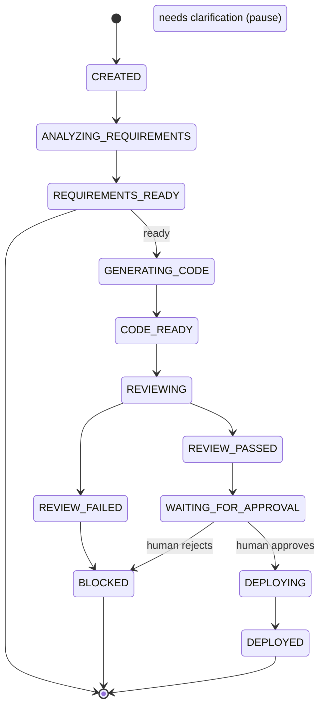
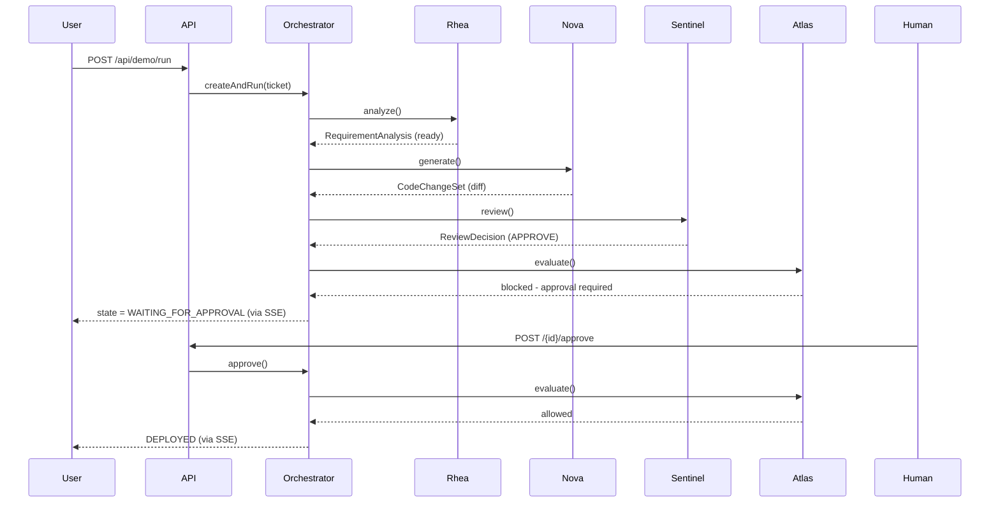
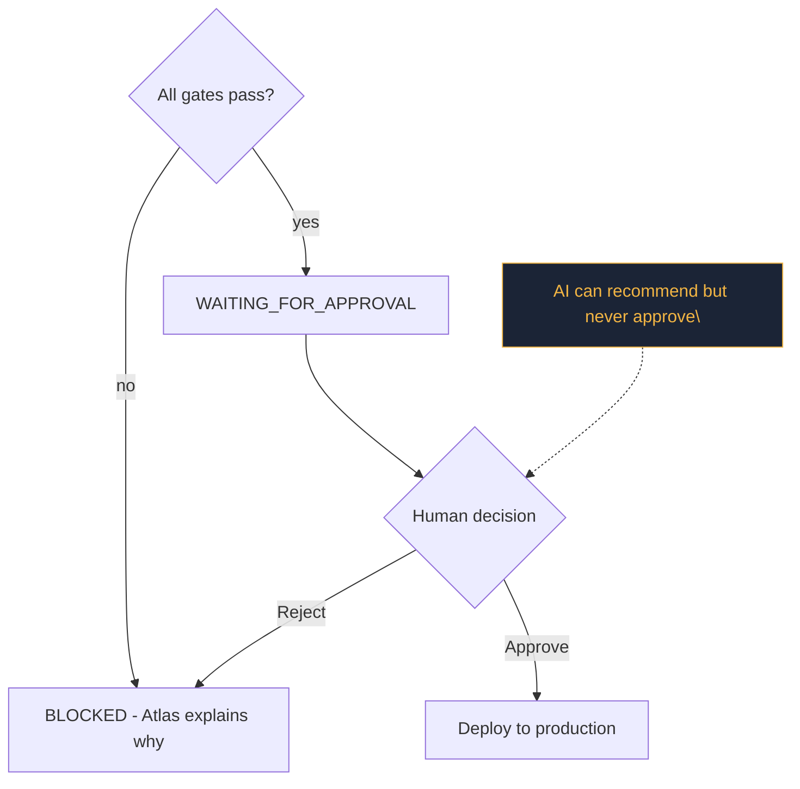

# Architecture

Enterprise Copilot is a **modular monolith** (Spring Boot)
plus a React dashboard. One process, clear
package boundaries, no premature microservices.

## 1. System architecture

## 2. Agent flow

## 3. Pipeline state machine

## 4. Sequence (happy path)

## 5. Human approval flow

## Persistence

`pipelines` stores the snapshot (structured agent outputs as JSON text columns for rtability across
H2 and PostgreSQL). `audit_events` is an append-only,
redacted trail. Flyway owns the schema
(`V1__init.sql`); Hibernate is `validate`-only.