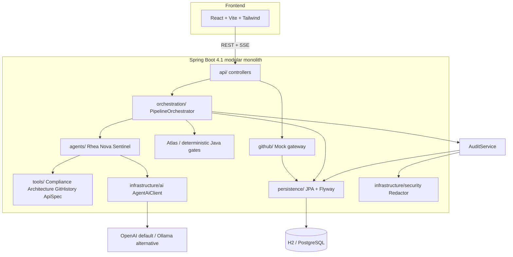
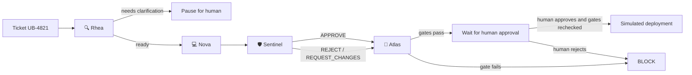
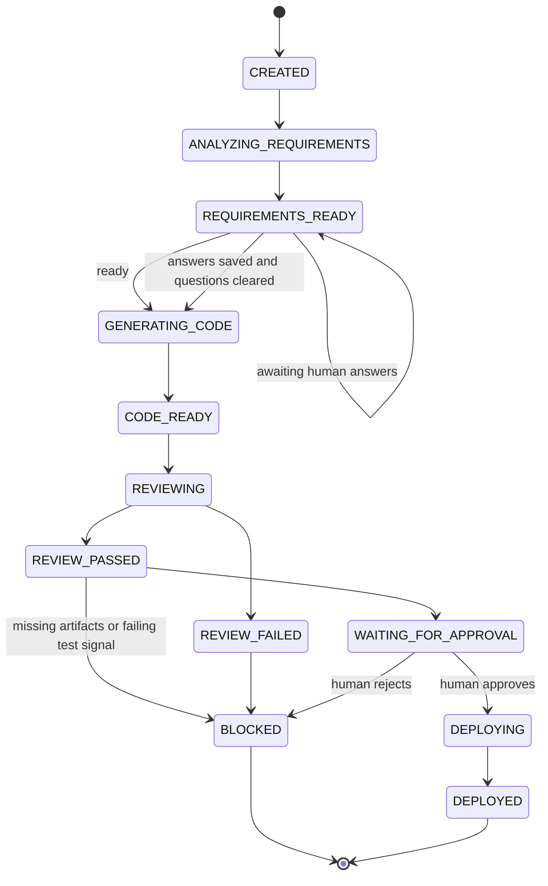
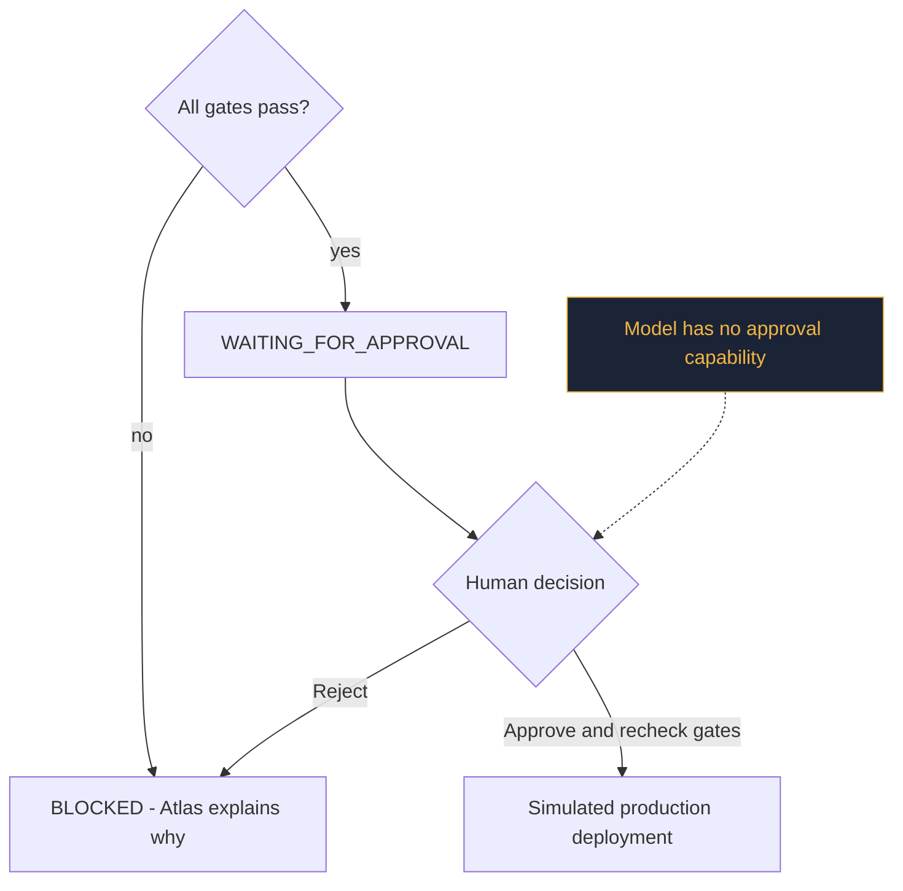

# Architecture

Enterprise Copilot is a **modular monolith** (Spring Boot)
plus a React dashboard. One process, clear
package boundaries, no premature microservices.

## 1. System architecture



## 2. Agent flow



## 3. Pipeline state machine



## 4. Sequence (happy path)

```mermaid
sequenceDiagram

    participant U as User
    participant API
    participant O as Orchestrator
    participant R as Rhea
    participant N as Nova
    participant S as Sentinel
    participant A as Atlas
    participant H as Human

    U->>API: POST /api/demo/run

    API->>O: createAndRun(ticket)

    O->>R: analyze()
    R-->>O: RequirementAnalysis (ready)

    O->>N: generate()
    N-->>O: CodeChangeSet (diff)

    O->>S: review()
    S-->>O: ReviewDecision (APPROVE)

    O->>A: evaluate()
    A-->>O: blocked - approval required

    O-->>U: APPROVAL_REQUIRED activity event; UI fetches state

    H->>API: POST /{id}/approve
    API->>O: approve()

    O->>A: evaluate()
    A-->>O: allowed

    O-->>U: completion events; UI fetches DEPLOYED snapshot
```

## 5. Human approval flow



## Persistence

`pipelines` stores the snapshot (structured agent outputs as JSON text columns for portability across
H2 and PostgreSQL). `audit_events` is an append-only,
redacted trail. Flyway owns the schema
(`V1__init.sql`); Hibernate is `validate`-only.

OpenAI is the default LIVE profile; Ollama and DEMO are explicit alternatives without failover.
DEMO supplies scripted results to the same first three agents and preserves all seven scenarios.
LIVE uses the ordinary ticket and actual model output, not deterministic scenario guarantees.
Human answers are saved into the analysis summary before async continuation. No chat memory is used.
SSE history is in-memory; state transitions overwrite snapshots rather than emitting a state-change event.
GitHub is a read-side projection requested by its controller; it is not an orchestrator side effect.
Approval endpoints are open local workshop controls, not authenticated human identity checks.