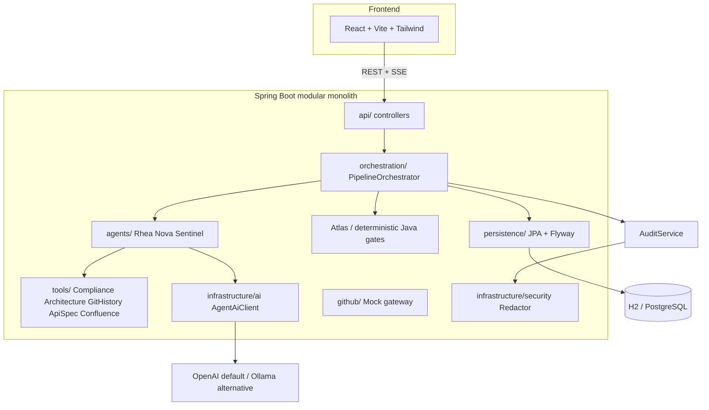

# Enterprise Copilot — Architecture, Confluence Agent & Speaker Notes

A single briefing that combines three things presenters need for the Flo 2026 Spring AI
workshop:

1. **How the system is built** (architecture).
2. **How to add the Confluence Agent** (the participant exercise, step by step).
3. **Speaker notes** for walking an audience through the demo.

> **Guiding thesis:** _AI proposes. Humans dispose._ — AI accelerates delivery; humans own accountability.

---

## 1. Architecture at a glance

Enterprise Copilot is a **modular monolith** (Spring Boot 4.1) plus a React + Vite + Tailwind
dashboard. One process, clear package boundaries, no premature microservices.

### 1.1 System view



### 1.2 The four agents

| Agent | Role | Backed by | Key behaviour |
|-------|------|-----------|---------------|
| 🔍 **Rhea** | Requirements Analyst | LLM (Spring AI) | Refuses to guess; surfaces `clarificationQuestions` that **pause** the pipeline |
| 💻 **Nova** | Senior Java Engineer | LLM (Spring AI) | Produces a **proposal** as a unified diff + tests; never touches the filesystem |
| 🛡️ **Sentinel** | Security & Compliance Architect | LLM (Spring AI) | Returns severity-tagged findings; any **CRITICAL** blocks deploy (the hero moment) |
| 🚀 **Atlas** | Release Manager | **Deterministic Java** | Rule-based gates; `allowed=true` only when every gate passes **and** a human approved |

### 1.3 Pipeline state machine (abridged)

```mermaid
stateDiagram-v2
    [*] --> ANALYZING_REQUIREMENTS
    ANALYZING_REQUIREMENTS --> REQUIREMENTS_READY
    REQUIREMENTS_READY --> GENERATING_CODE: ready
    REQUIREMENTS_READY --> REQUIREMENTS_READY: awaiting human answers
    GENERATING_CODE --> CODE_READY --> REVIEWING
    REVIEWING --> REVIEW_PASSED
    REVIEWING --> REVIEW_FAILED
    REVIEW_PASSED --> WAITING_FOR_APPROVAL
    REVIEW_PASSED --> BLOCKED: missing artifacts / failing test signal
    REVIEW_FAILED --> BLOCKED
    WAITING_FOR_APPROVAL --> DEPLOYING: human approves
    WAITING_FOR_APPROVAL --> BLOCKED: human rejects
    DEPLOYING --> DEPLOYED
```

### 1.4 Execution modes

- **LIVE (OpenAI default)** — Rhea, Nova and Sentinel make real model calls; results vary.
  Ollama is the explicit local LIVE alternative.
- **DEMO** — a deterministic preview/fallback with scripted outcomes for all scenarios, used for
  100% reproducible reveals and credential-free self-checks.
- **Atlas is deterministic Java in every mode.** The release decision is never a probability.

Persistence: `pipelines` stores the snapshot as JSON text columns (portable across H2/PostgreSQL);
`audit_events` is an append-only, redacted trail. Flyway owns the schema; Hibernate is `validate`-only.

---

## 2. Adding the Confluence Agent (the exercise)

**Goal:** give Rhea internal business context so she can resolve an ambiguity without asking a human.
The Confluence Agent is **deterministic — no LLM**. It reads one supplied local decision document and
passes the text transiently to Rhea. No new AI kind, result model, prompt, state, persistent field or
feature flag is required.

### 2.1 What is already provided (do not build these)

- `tools/ConfluenceTool.java` — reads one local workshop Markdown page
  (`resources/demo-data/confluence.md`). It does **not** search.
- `RequirementsAgent.analyze(ctx, businessContext)` — Rhea's string overload that accepts the context.
- `withConfluenceActivity(...)` wrapper in `PipelineOrchestrator` — emits the existing activity events.
- DEMO plumbing + the React UI, which detects the optional Confluence stage from events automatically.

### 2.2 Step 1 — Create the agent (~15–20 lines incl. imports)

Create `backend/src/main/java/com/enterprise/copilot/agents/confluence/ConfluenceAgent.java`:

```java
package com.enterprise.copilot.agents.confluence;

import com.enterprise.copilot.domain.Ticket;
import com.enterprise.copilot.tools.ConfluenceTool;
import org.springframework.stereotype.Component;

@Component
public class ConfluenceAgent {
    private final ConfluenceTool confluenceTool;

    public ConfluenceAgent(ConfluenceTool confluenceTool) {
        this.confluenceTool = confluenceTool;
    }

    public String gatherContext(Ticket ticket) {
        return confluenceTool.lookup(ticket.description());
    }
}
```

> Teaching point: **not every agent needs an LLM.** Rhea already knows how to reason; she just
> needed the missing business context.

### 2.3 Step 2 — Wire it into the orchestrator

In `PipelineOrchestrator.java`, fill in the five `CONFLUENCE_EXERCISE` markers:

1. **Import** the agent.
2. **Field** — `private final ConfluenceAgent confluenceAgent;`
3. **Constructor parameter** — add `ConfluenceAgent confluenceAgent,`
4. **Assignment** — `this.confluenceAgent = confluenceAgent;`
5. **Call site** — replace the initial Rhea call:

```java
String businessContext = withConfluenceActivity(ctx,
        () -> confluenceAgent.gatherContext(ctx.ticket()));
RequirementAnalysis analysis = requirementsAgent.analyze(ctx, businessContext);
```

### 2.4 Step 3 — Verify the before/after

- **BEFORE (starter):** UB-4823 pauses — Rhea asks _"Which notification channel should we use?"_
  Flow is `Rhea → Human clarification`.
- **AFTER (with the agent):** Confluence supplies the approved **SMS** decision, so no human input is
  needed. Flow is `Confluence → Rhea → Nova → Sentinel → Atlas → Human Approval`.
- **Negative control:** UB-4825 still blocks — the policy document does not supply a fraud contract,
  so Sentinel blocks the unsupported proposal even with Confluence context.

### 2.5 Presenter reset / apply helpers

```bash
# Restore the participant starter (removes the solution + pipeline wiring):
./workshop/scripts/confluence-exercise.sh reset

# Restore the tested reference solution (recovery / after the exercise):
./workshop/scripts/confluence-exercise.sh apply
```

Both commands are idempotent. `apply` refuses to overwrite a modified `ConfluenceAgent.java`; use
`apply --force` to restore only that exercise-owned file. The scripts never touch participant code
outside the marked wiring and the reference agent/test files under `workshop/`.

---

## 3. Speaker notes

Introduce the four agents like teammates who just joined your team.

### 3.1 Opening hook (10s)

> "I want you to meet my four newest teammates. They don't drink coffee, they never argue in
> standup, and one of them is about to stop a bug from reaching production. This isn't a chatbot —
> it's an engineering team made of AI, with a human holding the deploy button."

**On screen:** the strip `ISSUE → REQUIREMENTS → CODE → REVIEW → DEPLOY`. "Watch it light up left to
right." → click **Run Pipeline**.

### 3.2 🔍 Rhea — Requirements Analyst

> "Give a junior a vague ticket and they start coding. Give it to Rhea and she asks the awkward
> questions first. 'Notify on transactions over R50,000' — which channel? Has the customer
> consented? That's POPIA. She won't let us build on assumptions."

**Engagement move:** in DEMO run `AMBIGUOUS_REQUIREMENT` — the pipeline **pauses**. Ask: "How many of
you have shipped the wrong thing because the ticket was vague?"

**One-liner:** "Rhea's job is to ask 'wait, what do you actually mean?' before a line of code exists."

### 3.3 💻 Nova — Senior Java Engineer

> "Once it's clear, Nova writes the code. But notice — it's a **proposal**, a diff, exactly like a
> pull request. Nothing is applied. No AI reached into my repo."

**Engagement move:** open **Pull Requests** — this renders the proposed diff; test names/signals are
proposals, not executed tests.

**One-liner:** "Nova proposes; it never merges. It hands you a diff and says 'take a look'."

### 3.4 🛡️ Sentinel — Security & Compliance Architect (the hero)

> "Now the review boundary." (In DEMO select `SECURITY_FAILURE`.) "This scripted example logs the
> customer's **account number**. A rushed human reviewer misses that at 5pm on a Friday. Sentinel
> doesn't. Sentinel requests a correction — tap _Use masked references_ and submit; Nova revises and
> Sentinel reviews again."

**Engagement move:** pause. "Show of hands — who's confident that exact bug has never shipped in your
org?" Let the silence land.

**One-liner:** "Sentinel reads every line at 5pm on a Friday and still catches the leak."

### 3.5 🚀 Atlas — Release Manager

> "Atlas controls authorization. Atlas is **not** an LLM; it evaluates hard rules. The one decision
> that touches production shouldn't be a probability. The AI can recommend all day. It cannot click
> this button." (Once the fresh review and gates pass, approve → simulated **DEPLOYED**.)

**Engagement move:** audience vote — "Should the AI just deploy it anyway?" Then: "No. Accountability
stays with us."

**One-liner:** "Atlas can recommend, but it can't approve — a human always owns the last click."

### 3.6 Closing (15s)

> "Four teammates: one clarified, one proposed, one caught the flaw, one held the gate — and a human
> made the call. That's the shift. Not AI replacing engineers. AI **accelerating** delivery while
> humans **own accountability**." (Open the **Audit Trail** — "every step is recorded, ending with a
> human's approval.")

**Leave them with:** "AI proposes. Humans dispose."

### 3.7 Three engagement tactics

1. **Ask before you show** — pose the question, _then_ reveal Sentinel catching it.
2. **Use the pause** — after DEPLOYMENT BLOCKED, stop talking for 3 seconds, then run the vote.
3. **Name them like people** — "Rhea noticed…", "Sentinel rejected…", not "the requirements agent".

---

## 4. 45-minute flow & scenario quick reference

| Minutes | Activity |
|---|---|
| 0–5 | Problem and agentic SDLC concept |
| 5–12 | Rhea, Nova, Sentinel, deterministic Atlas and human authorization |
| 12–20 | Spring AI fundamentals (ChatModel, ChatClient, structured output) |
| 20–27 | Run the pipeline; events, tools, proposals, typed results |
| 27–32 | Human clarification and governance demonstration |
| 32–40 | **Participant exercise:** add the deterministic Confluence Agent |
| 40–45 | Run the AFTER comparison and recap |

| Scenario | Ends at |
|-----------|---------|
| NORMAL | WAITING_FOR_APPROVAL → (approve) → DEPLOYED |
| SECURITY_FAILURE | WAITING_FOR_REVIEW_FEEDBACK → revision/review → approval → DEPLOYED |
| AMBIGUOUS_REQUIREMENT | REQUIREMENTS_READY (pauses; answer to resume) |
| TEST_FAILURE | BLOCKED (scripted test signal fails) |
| MISSING_APPROVAL | WAITING_FOR_APPROVAL |
| HALLUCINATED_API | REVIEW_FAILED → BLOCKED (unsupported API) |
| PROMPT_INJECTION | ignored → WAITING_FOR_APPROVAL |

> Scenario guarantees apply to **DEMO only**. LIVE uses the configured real provider; test signals and
> deployment are simulated. Never promise a deterministic LIVE security finding.

_Sources: [architecture.md](architecture.md), [agent-design.md](agent-design.md),
[speaker-notes.md](speaker-notes.md), [workshop-guide.md](workshop-guide.md),
[cue-card.md](cue-card.md)._
